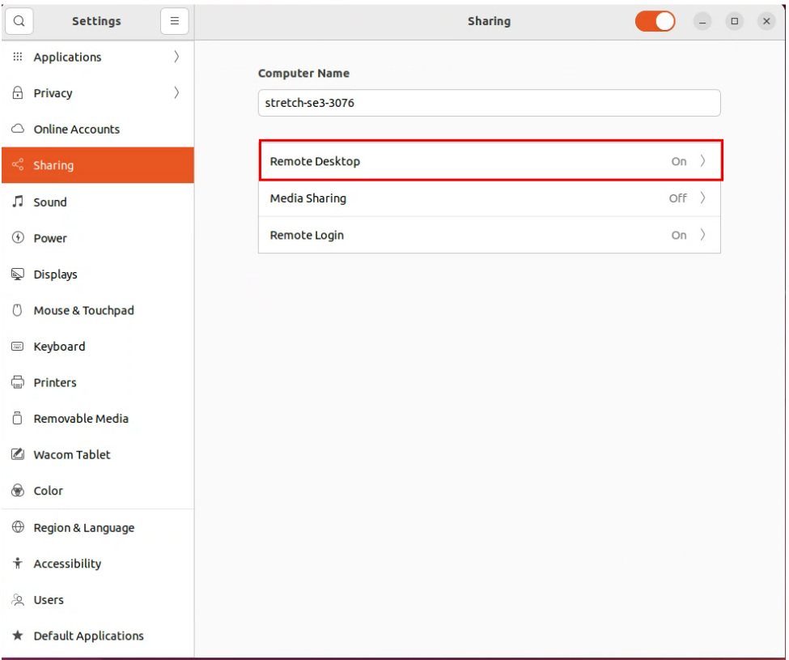
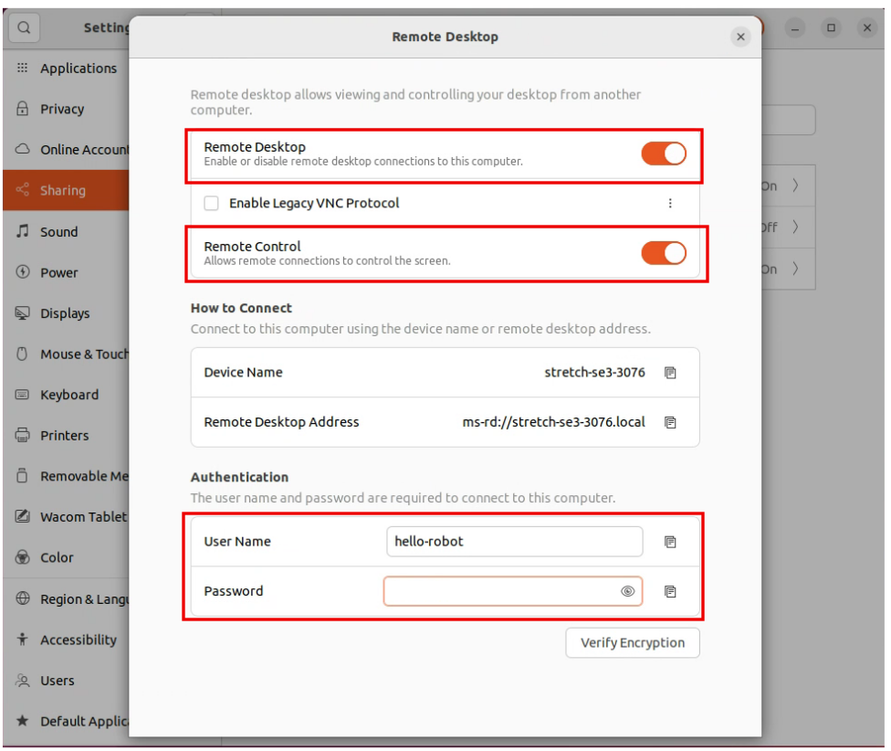
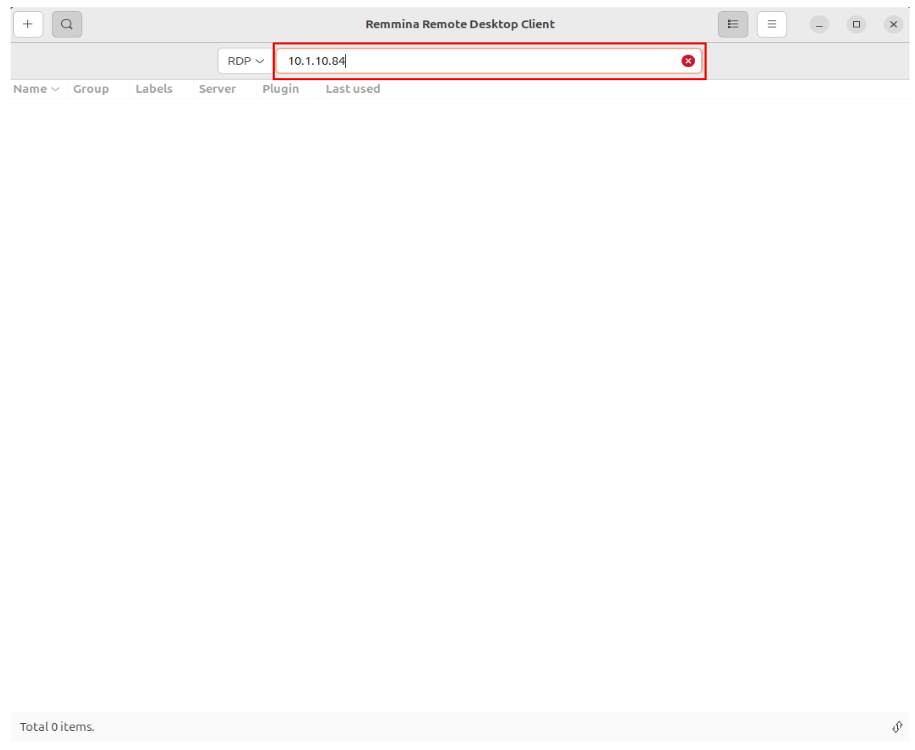
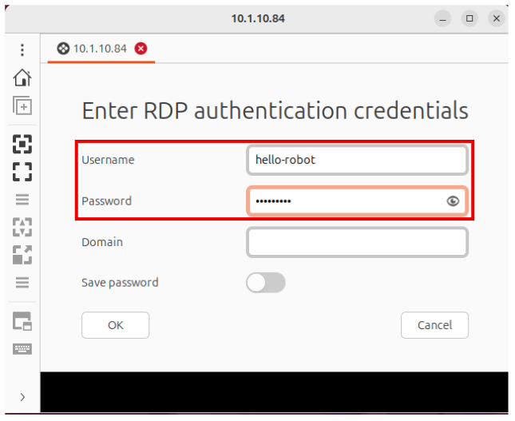
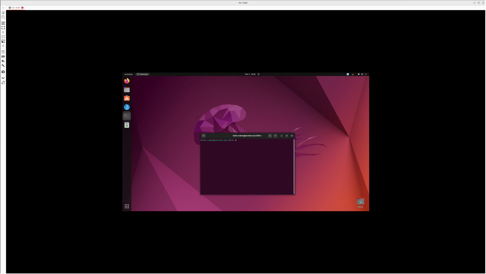

# Remote Desktop (RDP) Access to a Stretch 3 Robot (Ubuntu 22.04) from Your Host (Ubuntu 24.04)

This guide shows how to enable and use **RDP** to access the Stretch 3 robot’s onboard computer from your own machine running Ubuntu 24.04.

**Note: On Ubuntu 22.04, the robot must already be logged into its desktop session locally before you can connect via RDP.**

## On the Stretch 3 Robot (Ubuntu 22.04)

### Enable Remote Desktop

1. Connect a monitor/keyboard to the Stretch 3 (or use the robot’s VNC if enabled).

2. Log into the robot’s Ubuntu desktop.

3. Open:

    `Settings` → `Sharing` → `Remote Desktop`

  

 

4. Turn ON:

    ◦ Remote Desktop

    ◦ Remote Control

    ◦ Require a password

  

 

5. **Set the RDP username and password you will use to connect.**

6. Leave the robot logged into the desktop session
(Ubuntu 22.04 RDP does not work from the login screen).

## On Your Host Computer (Ubuntu 24.04)

# Connect to the Stretch 3 with Remmina

1. Open Remmina.

2. Select `RDP` from the protocol dropdown.

3. In the address bar, enter the robot’s IP address
(example: `10.1.10.84`).

  

 

4. Press Enter.

5. When prompted:

    ◦ `Username`: the robot’s Ubuntu user (e.g., `hello-robot`)

    ◦ `Password`: the RDP password you set

    ◦ `Domain`: leave blank

  

 

6. Click OK → you should now see the Stretch 3 desktop.

  

